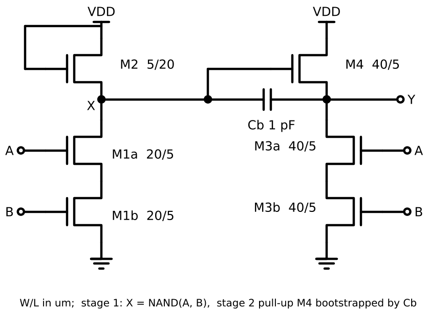
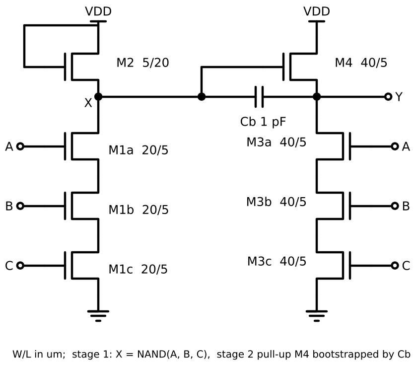
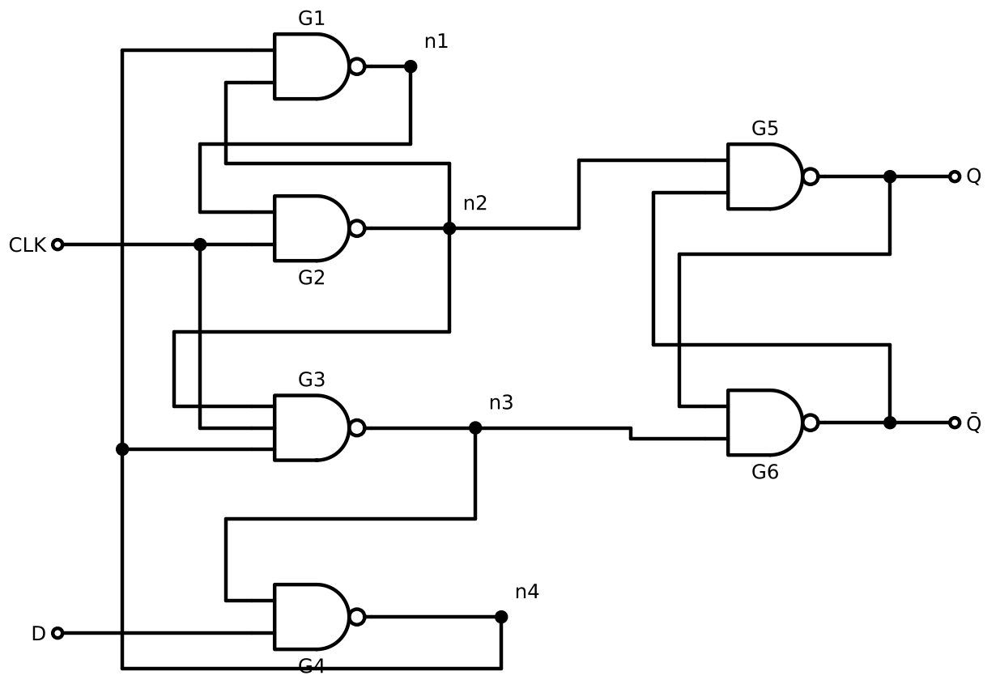
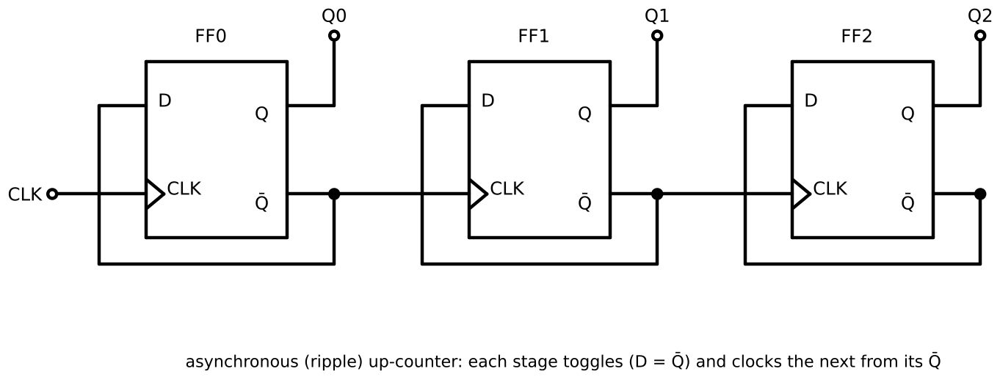
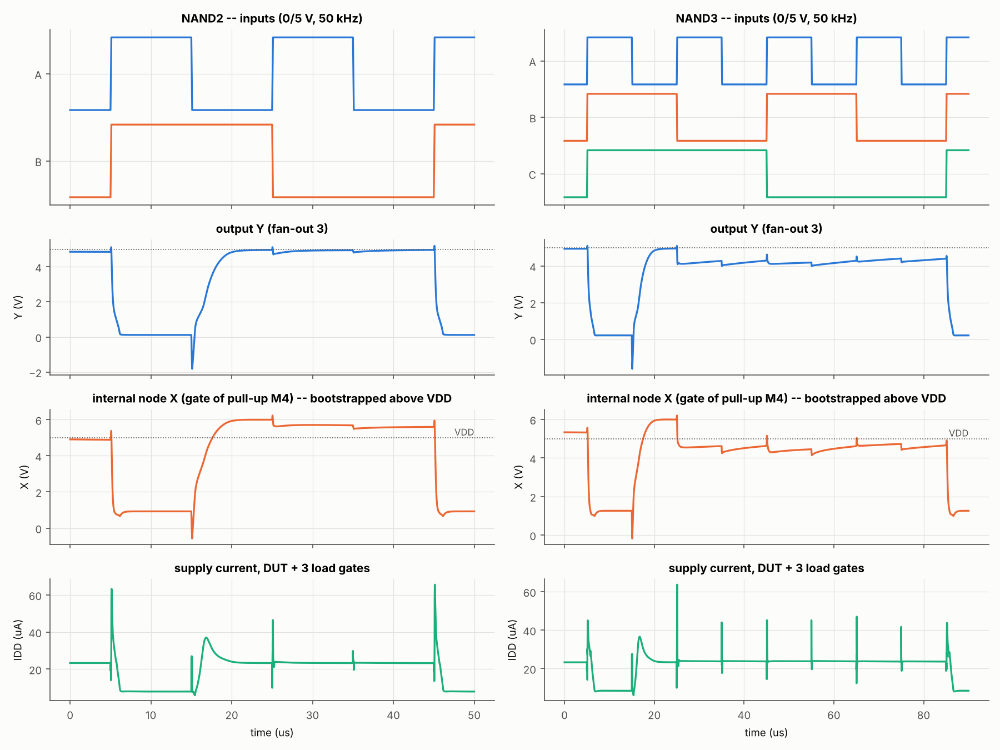
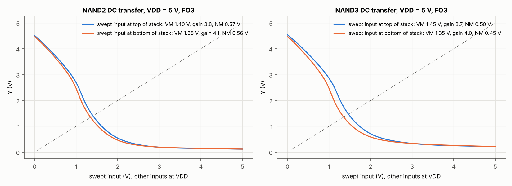
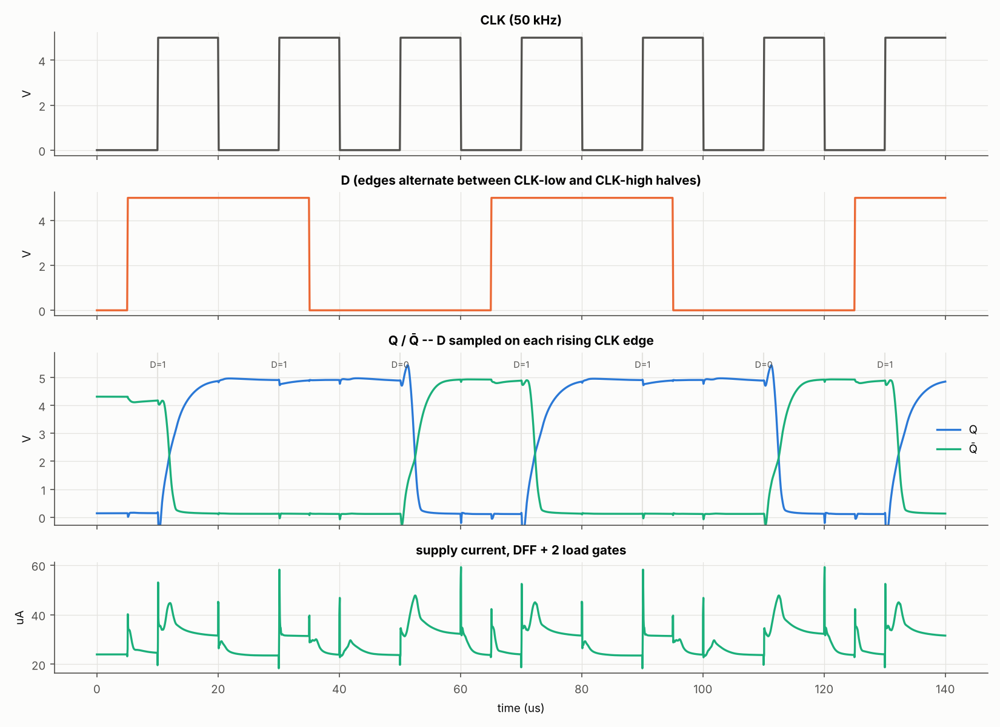
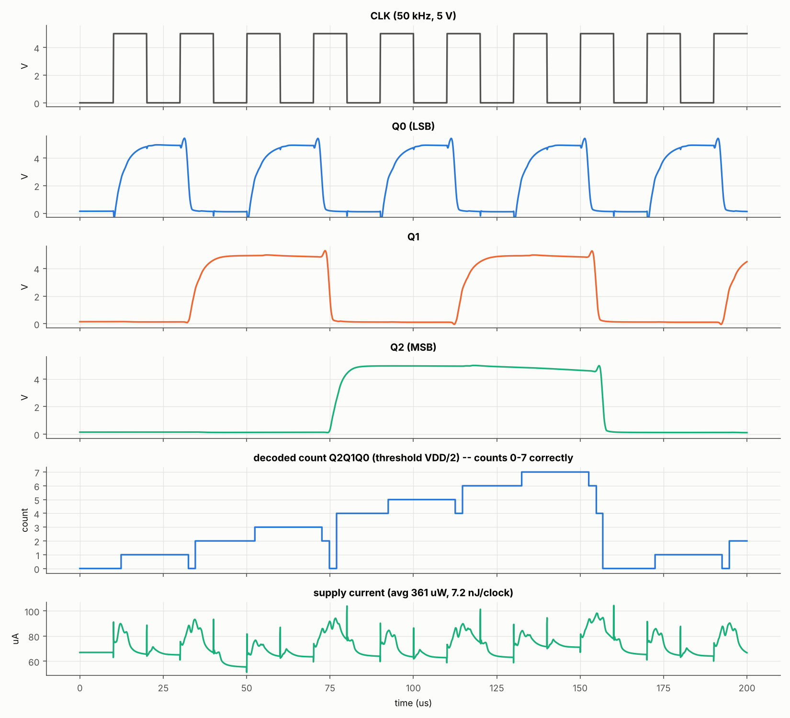
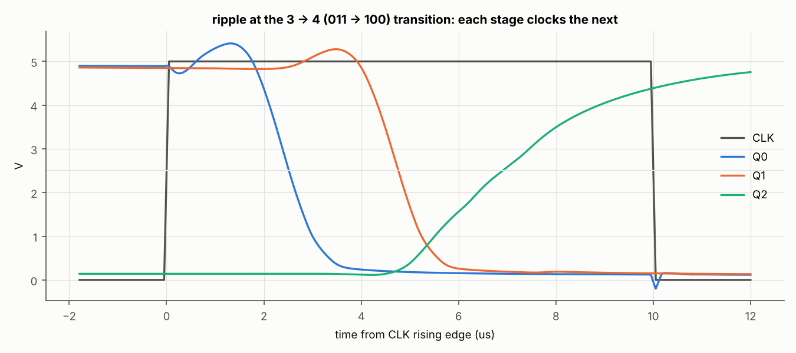
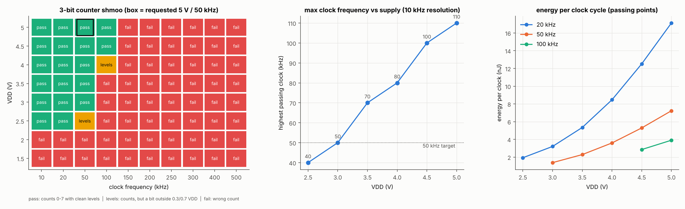

# Bootstrapped pseudo-CMOS logic with `ntft_full.va`: NAND2/NAND3, D flip-flop, 3-bit counter

Requested: run all three at **50 kHz, 5 V rail to rail** using the full ID + CGD + CGS
Verilog-A model, then give schematics and performance plots.

**Result: all three circuits work at 5 V / 50 kHz.** The counter counts 0..7 and wraps,
with about 2x margin in frequency (f_max = 110 kHz at 5 V) and in supply (50 kHz still
works at 3.0 V). The operating-window analysis is in [section 4](#4-operating-window-vdd-x-frequency).

This was only possible after one change to how the model stamps its capacitors
([section 1](#1-the-model-and-the-one-change-it-needed)). The `.va` as written cannot
be simulated through a logic transition.

Regenerate everything with:

```
python scripts/logic_sizing.py         # gate sizing sweep        -> sizing_sweep.csv
python scripts/logic_schematics.py     # schematics               -> *_schematic.png
python scripts/logic_circuits.py       # 5 V / 50 kHz benches     -> *_5V_50k.png, metrics_5V_50k.json
python scripts/logic_shmoo.py          # VDD x f window           -> shmoo.csv, shmoo.png
python scripts/logic_sensitivity.py    # D/S symmetry check       -> sensitivity_symmetric.json
python scripts/logic_ngspice_check.py  # independent ngspice run  -> ngspice_check.{png,json}
```

---

## 1. The model, and the one change it needed

**The weights, clamps and C-V values are `verilogA/ntft_full.va`'s, unchanged.** No
Verilog-A compiler (OpenVAF/ADMS) can be installed in this environment. So the `.va`
is executed two ways, both reading the weights straight out of the `.va` text:

* `src/tran.py` is a vectorised transient simulator. It evaluates the `.va`'s three
  nets for every device at once, with exact analytic Jacobians (checked against
  finite differences to 1e-8). It integrates with variable-step Gear-2 (BDF2) and
  never steps across a source breakpoint. The full counter takes about 25 s.
* `src/ngspice_tft.py` transliterates the `.va` into ngspice-42 behavioural sources.
  It reproduces `src/va_model.py` to within 0.1% on ID and charge, but takes about
  10 ms per device evaluation. It is therefore used only as an independent check on
  one gate ([section 5](#5-validation)).

### Why `ddt(C*V)` cannot simulate logic

The `.va` ends with

```
qgd = cgd * V(G,D);   I(G,D) <+ ddt(qgd);
```

The incremental capacitance the simulator sees is therefore `C + V(G,D)*dC/dV`, not
`C`. In logic, a gate crosses threshold while its drain sits at VDD, so V(G,D) is
about −4 V just where CGD rises steeply. Gate swept 0 → 2 V with D = 5 V, S = 0:

| device | VG | CGD (model) | dQgd/dVG seen by the simulator | dQgs/dVG |
|---|---|---|---|---|
| 80/5 um | 0.7 V | 0.41 pF | **−5.94 pF** | +1.60 pF |
| 20/20 um | 0.6 V | 0.49 pF | **−4.26 pF** | +0.92 pF |

The gate node ends up with net **negative capacitance**, so the node equations have
no solution through the turn-on knee. This is a property of the equations, not of
the solver:

* `src/tran.py` with the `.va`'s form cannot even find the t = 0 operating point of
  a NAND2 ("DC settle failed"). Newton fails at every step size down to 4 fs.
* ngspice, running the same form: see `ngspice_check.json` → `qcv_ngspice`.

A compiled `.va` in Spectre would hit the same wall.

**Fix used for every result here: `verilogA/ntft_full_cdv.va`.** It is byte-for-byte
the same file except for three lines:

```
I(G,D) <+ cgd*ddt(V(G,D));
I(G,S) <+ cgs*ddt(V(G,S));
```

The incremental capacitance is now exactly the measured C ≥ 0. Strictly, that is
what a C-V measurement reports anyway (C = dQ/dV). A properly charge-conserving
`Q = integral(C dV)` model would be better still, but it needs a VDS-aware C-V
dataset this repo doesn't have.

---

## 2. Circuits

### Bootstrapped pseudo-CMOS NAND (n-type only, single 5 V supply)




**Stage 1** is a level shifter with a diode-load M2 and a series stack M1, giving
X = NAND(inputs). X drives the gate of the source-follower pull-up M4.

**Stage 2's** pull-down stack M3 is driven by the inputs directly. So when the output
falls, M4 is already being turned off by stage 1 rather than fighting the pull-down.
That is the pseudo-CMOS trick that makes VOL small without a ratioed output stage.

**Cb** (in parallel with M4's own CGS) bootstraps X above VDD as Y rises. In the
50 kHz runs X reaches **6.2 V**, so M4 stays on and Y reaches 4.94 V instead of
stalling at VDD − Vth (the 4.33 V median with no Cb in the sizing sweep).

Sizing (W/L in um), picked from a 446-point sweep (`sizing_sweep.csv`, NAND2 driving
fan-out 3 at 5 V / 50 kHz):

| M1 stack | M2 diode | M3 stack | M4 pull-up | Cb |
|---|---|---|---|---|
| 20/5 | 5/20 | 40/5 | 40/5 | 1 pF |

M2 is the weakest device the model covers. It sets the static current (about 8 µA
per gate whose X is low) and, as section 4 shows, the maximum clock rate.

### D flip-flop: 5 NAND2 + 1 NAND3, positive edge-triggered



This is the classic 7474 core without preset/clear. G3 is the 3-input gate. It takes
38 TFTs and 6 bootstrap capacitors.

### 3-bit counter: three toggle flip-flops in ripple



Each stage has D = Q̄ and clocks the next stage from its Q̄, which makes an up-counter.
That is 114 TFTs, plus one NAND2 observer load on each Q (132 TFTs in the bench). The
power-on state 000 is set with a nodeset, since the 7474 core has no reset.

---

## 3. Results at 5 V, 50 kHz

All loads are real gates. NAND outputs drive fan-out 3 (the busiest node inside the
DFF). Inputs have 100 ns edges.

### NAND2 / NAND3




| | NAND2 | NAND3 |
|---|---|---|
| truth table | correct | correct |
| VOH (transient, worst) / VOL | **4.94 V** / 0.12 V | 4.19 V / 0.21 V |
| tpHL / tpLH (50%–50%, FO3) | **0.21 µs / 1.82 µs** | 0.38 µs / 1.71 µs |
| fall / rise (90–10 / 10–90) | 0.84 µs / 3.27 µs | 1.21 µs / 2.27 µs |
| bootstrapped X, peak | 6.23 V | 6.20 V |
| DC VTC: VM / peak gain | 1.35–1.40 V / 3.8–4.1 | 1.35–1.45 V / 3.7–4.0 |
| DC noise margin (MEC, largest square) | 0.56–0.57 V | 0.45–0.50 V |
| DC VOH (no bootstrap in DC) | 4.48–4.51 V | 4.48–4.54 V |

Notes on reading the table:

* **Rise vs fall.** Rising edges are about 9x slower than falling ones. The rise is
  carried by the diode load M2 charging X, while the fall has the input-driven M3
  stack.
* **NAND3 VOH.** Its worst VOH (4.19 V) comes from charge sharing. When the top
  input rises while a lower one is low, X shares charge with the two internal stack
  nodes.
* **VM and noise margin.** VM sits low (about 1.4 V) because the L = 5 µm devices
  already conduct about 10 nA at VGS = 0. That also puts the VTC slope past −1 at
  Vin = 0, so the unity-gain VIL/VIH definition breaks down, and the
  maximum-equal-criterion square is reported instead. Cascaded gates restore full
  levels, as the DFF and counter show.
* **Undershoot.** When an input falls, the off-state CGD (which the model keeps as
  large as the on-state value) kicks the low output to −1.8 V for about 0.2 µs.
  Section 5 shows how much of this is model artifact.

### D flip-flop



| | |
|---|---|
| function | correct on all 7 edges; D changes while CLK is high are ignored |
| CLK→Q rise / fall (50%) | **2.53 µs / 2.36 µs** |
| VOH / VOL (worst sampled) | 4.81 V / 0.13 V |
| bench power (DFF + 2 load gates) | 147 µW |

### 3-bit counter




| | |
|---|---|
| count sequence (sampled before each clock edge) | 1 2 3 4 5 6 7 0 1, **correct** |
| CLK→Q0 / Q1 / Q2 (worst) | **2.51 / 4.79 / 6.90 µs** (ripple) |
| VOH / VOL (worst sampled) | 4.63 V / 0.15 V |
| average power | **361 µW** (about 330 µW of it static) |
| energy per clock | 7.2 nJ |

The decoded count shows short glitches (for example 3 → 2 → 0 → 4) while the ripple
propagates. That is inherent to an asynchronous counter. Sample it at least about
7 µs after the clock edge, or add an output register.

---

## 4. Operating window: VDD x frequency

The requested point works, so this section maps the margin rather than rescuing a
failure. Same sizing everywhere. A point passes if the count runs 1..7,0,1 and every
sampled bit is within 0.3/0.7 VDD.



| VDD | 2.0 | 2.5 | 3.0 | 3.5 | 4.0 | 4.5 | **5.0** |
|---|---|---|---|---|---|---|---|
| highest passing clock | none | 40 kHz | 50 kHz | 70 kHz | 80 kHz | 100 kHz | **110 kHz** |
| power at 50 kHz | n/a | n/a | 69 µW | 114 µW | 180 µW | 265 µW | 361 µW |
| energy / clock at 50 kHz | n/a | n/a | 1.4 nJ | 2.3 nJ | 3.6 nJ | 5.3 nJ | 7.2 nJ |

* **Ceiling: the slow rising edges.** The DFF alone, clocked by an ideal source, still
  captures correctly at 150 kHz, but VOH has fallen to 2.65 V and VOL risen to 1.0 V
  half a period later. Each output needs about 2.4 µs CLK→Q plus about 3 µs of rise
  per half period, so 110–150 kHz is the limit at 5 V. The counter fails first in
  its last stage (3 → 0 instead of 3 → 4), which is clocked by the previous stage's
  slow Q̄ edge.
* **The speed lever is M2.** The sizing sweep shows M2 = 10/5 halves tpLH (1.0 µs)
  for about 2x the static power. Power is almost all static diode-load current, so it
  barely scales with frequency (338 µW at 10 kHz, 391 µW at 100 kHz, 5 V), and
  energy per clock drops as frequency rises.
* **Below about 2.5 V the stage-1 diode load stops working.** X can't rise far enough
  above M4's threshold, so logic levels collapse to around VDD/2.
* **Above 5 V is out of reach for this model.** The ANN's VD input is clamped at
  5 V (the training box), so anything above 5 V would be meaningless rather than
  merely inaccurate. Even at 5 V, the bootstrapped X (6.2 V) puts the top M1 above
  VD = 5 V. It is off at that moment, so only its leakage is affected.

**Recommendation**

* **5 V, 50 kHz (as requested)** is a sound choice: 2.2x frequency margin and 2 V of
  supply margin.
* **For lowest power at 50 kHz, run at 3.5 V.** It is 3.2x lower power (114 µW,
  2.3 nJ/clock) and keeps a 70 kHz edge, i.e. 40% margin. 3.0 V also passes, but
  sits right on the edge.
* **For the fastest clock, use 5 V and stay at 100 kHz or below.** 110 kHz is the
  last passing point.

---

## 5. Validation

* **Independent solver.** ngspice-42 runs the same NAND2 bench with the transliterated
  `ntft_full_cdv` model, using its own Gear integrator and LTE control. See
  `ngspice_check.png` / `ngspice_check.json`.
* **Jacobians.** Analytic derivatives (ID, both capacitor forms, symmetric option)
  agree with central finite differences to 1e-8 relative.
* **Reverse conduction (`sensitivity_symmetric.json`).** The `.va` clamps VDS < 0, so a
  device never conducts backwards (a defect already listed in `outputs/va_test`).
  Re-running with D/S swapped for VDS < 0 changes the counter's CLK→Q delays by
  ≤ 2.3% and power by 1.4%, and the count is still correct. The NAND2 undershoot
  shrinks from −1.81 V to −1.31 V, so most of it is real CGD feedthrough.

## 6. Caveats

* **L = 5 µm capacitance is extrapolated.** Every switching device is L = 5 µm for
  speed, but the C-V nets were trained only at (20,20), (40,20), (160,15) and
  (160,20) µm. Absolute delays and f_max lean on that extrapolation. Logic function
  and levels do not.
* **CGD has no real VDS dependence.** CGD ≈ CGS even in saturation, so Miller
  feedthrough and undershoot are probably overstated. Real delays are likely somewhat
  shorter.
* **ID(VDS = 0) is about 1–3 nA, not 0.** This mostly shows up as small offsets on
  stack nodes.
* **10 TΩ shunt.** Every node has a 10 TΩ shunt to ground (ngspice `rshunt` style) so
  that isolated stack nodes stay defined. That is ≤ 0.5 pA, below device leakage.
